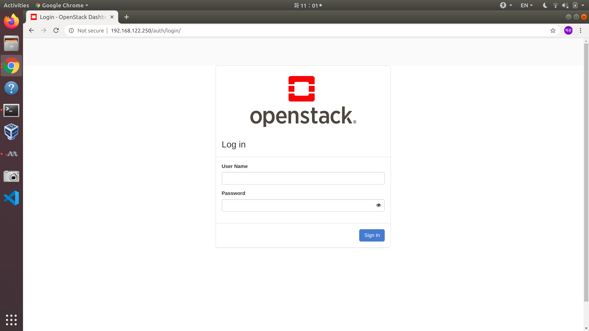

# Kolla-Ansible

## Kolla-Ansible 을 사용한 Container 기반 OpenStack-train 구축

Kolla-Ansible은 docker container와 Ansible을 사용하므로 사전 지식이 있으면 사용하기 편리하다.

### 환경셋팅, Base VM Configuration

```
HOST
	- Ubuntu 18.04
	- CPU: 5 Core
	- Mem: 16G
Hypervisor
	- QEMU/KVM
VM
	- CentOS 7 1908 minimal
users:
- root, toor
- stack, dkagh1.
- Controller
    - cpu: 4
    - mem: 10240MB
    - NIC:
        - NAT(192.168.122.11/24)
        - Internal(192.168.123.11/24)
        - NAT(DHCP)
    - Disk:
        - additional 20 GB disk
    - hostname: controller.cccr.co.kr
- Compute
    - cput: 2
    - mem: 4096 MB
    - NIC:
        - NAT(192.168.122.21/24)
        - Interal(192.168.123.21/24)
    - hostname: compute.cccr.co.kr
```

---

# Install Openstack

공식문서를 참조하며 설치 진행

[Quick Start](https://docs.openstack.org/kolla-ansible/latest/user/quickstart.html)

## 1. 종속성 설치

### 1) python build 종속성 설치

```
$ sudo yum install -y python-devel libffi-devel gcc openssl-devel libselinux-python
```

### 2) 가상 환경을 사용하는 종속성 설치

```
$ sudo yum install -y python-virtualenv
```

```
$ virtualenv ~/kolla
```

```
$ source ~/kolla/bin/activate
```

```
$ pip install -U pip
```

```
$ pip install 'ansible==2.9'
```

## 2. kolla-ansible 설치

### 1) kolla-ansible 파일 다운로드

```
$ pip install kolla-ansible
```

### 2) /etc/kolla 디렉토리 생성

```
$ sudo mkdir -p /etc/kolla
```

```
$ sudo chown $USER:$USER /etc/kolla
```

### 3) globals.yml, password.yml 파일 복사

```
$ cp -r ~/kolla/share/kolla-ansible/etc_examples/kolla/* /etc/kolla
```

### 4) 인벤토리 파일 복사

```
$ cp ~/kolla/share/kolla-ansible/ansible/inventory/* .
```

## 3. ansible 구성

### 1) 설정파일 수정

```
$ sudo mkdir /etc/ansible
```

> $ sudo vi /etc/ansible/ansible.cfg

```
[defaults]
host_key_checking=False
pipelining=True
forks=100
```

### 2) 키기반 설정

```
$ ssh-keygen
$ ssh-copy-id $USER@localhost
$ ssh-copy-id $USER@192.168.122.11
$ ssh-copy-id stack@192.168.122.21
```

### 3) 인벤토리 수정

> $ vi multinode

```
[all:vars]
ansible_become_pass='dkagh1.'

[control]
control01       ansible_host=192.168.122.11  ansible_become=true

[network]
network01       ansible_host=192.168.122.11  ansible_become=true

[compute]
compute01      ansible_host=192.168.122.21  ansible_become=true

[monitoring]
monitoring01    ansible_host=192.168.122.11  ansible_become=true

[storage]
storage01       ansible_host=192.168.122.11  ansible_become=true

[deployment]
localhost       ansible_host=192.168.122.11  ansible_become=true
...
```

### 4) 패스워드 파일 수정

```
$ kolla-genpwd
```

> $ vi /etc/kolla/passwords.yml

```
...
keystone_admin_password: dkagh1.
...
```

### 5) 변수 파일 조정

> $ vi /etc/kolla/globals.yml

```
 15 kolla_base_distro: "centos"
 18 kolla_install_type: "binary"
 21 openstack_release: "train"
 37 kolla_internal_vip_address: "192.168.123.250"
 48 kolla_external_vip_address: "192.168.122.250"
 98 network_interface: "eth1"
102 kolla_external_vip_interface: "eth0"
130 neutron_external_interface: "eth2"
248 enable_cinder: "yes"
252 enable_cinder_backend_lvm: "yes"
433 glance_backend_file: "yes"
```

## 4. 스토리지 준비

### cinder-volumes 준비

```
$ sudo pvcreate /dev/vdb
$ sudo vgcreate cinder-volumes /dev/vdb 
```

## 5. 배포

### 1) bootstrap

```
$ kolla-ansible -i ./multinode bootstrap-servers
```

### 2) prechecks

```
$ kolla-ansible -i ./multinode prechecks
```

### 3) image pull

```
$ kolla-ansible -i ./multinode pull
```

### 4) deploy

```
$ kolla-ansible -i ./multinode deploy
```

---

### 생성된 오픈스택 화면



설치한 뒤 Dashboard 접속 화면


admin 사용자로 로그인

위 오른쪽 상단 OpenStack RC File을 로컬로 복사하여 source <OpenStack RC File>로 CLI 로그인 가능, Packstack 의 keystonerc 파일 대체


Controller Node에서 설치 확인, docker container로 구성된걸 확인

### *public network connect ifname

외부네트워크 설정시 물리네트워크의 이름 확인 가능

```yaml
$ sudo grep -r br-ex /etc/kolla/
```

---

### 인스턴스를 생성하여 정상적인 동작 확인

Create Resources

```
## Admin

1. 프로젝트
2. 사용자
3. 플레이버
4. 공통이미지
5. 외부네트워크

## User

1. 내부 네트워크
2. 라우터
3. 보안그룹
4. keypair
5. 인스턴스
6. 유동IP
7. 볼륨
```


testuser overview, 생성된 리소스들 확인


생성한 cirros 인스턴스 콘솔화면

# Description

오픈스택 리소스 분석

## Network

- External( by admin )
    - Provider Network Type: flat, 물리네트워크로 1개만 지정 가능
    - Physical Network: 실제 br-ex와 연결되는 물리 네트워크 인터페이스

        확인방법

        ```yaml
        $ grep -r 'br-ex' /etc/kolla
        ```

    - shared, external option: admin 역할만 지정 가능
    - gateway

        확인방법

        ```yaml
        $ ip route
        ```

    - DHCP uncheck

        외부 네트워크는 실제 물리적인 네트워크 대역이므로 체크 해제

        (하나의 네트워크에 DHCP 두개 있으면 충돌 가능성 up)

    - Allocation Pools

        floating ip 할당 대역 지정

    - DNS

        보통 외부네트워크에는 안넣어도 이상 무, 자동셋팅, (실제 인스턴스가 사용하지 않기때문) (private에는 지정해야함)

- Internal ( by user )
    - 내부네트워크 생성 과정, 원리

        ```
        nova-api → neutron-server 요청 → neutron-dhcp-agent → dnsmasq(process)
        * dnsmasq (= dhcp 서버 역할)
        ```

    - Enable DHCP check
    - DNS Name Server 지정

        지정하지 않은 네트워크를 사용하는 인스턴스는 /etc/resolv 파일이 비어있음

⇒ Router 생성후 Router에 Gateway는 외부네트워크 할당하고, Interface에는 내부 네트워크 인터페이스 연결 후 인스턴스에 Floating ip 할당

## Security Group

방화벽을 인스턴스에서 직접사용하지 않고 앞단에서 템플릿처럼 사용하므로 관리와 사용이 편리, 클라우드에서의 오토스케일링 등 인스턴스의 유동성을 고려하면 훨씬 편리하다.

또한 패킷을 라우터단에서 거르는지 뒤에서 거르는지에 대한 이슈도 있다.

Port: 오픈스택에서 Port는 LAN port 로 생각하면 되고, Securty Group을 port에 할당할 수 있다, Floating ip 또한 Port에 할당할 수 있다.

보통 서비스 별로 SG 분류하여 사용